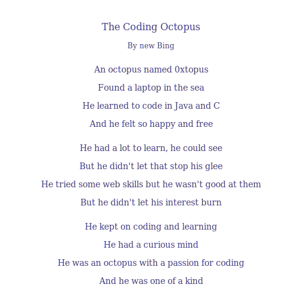

  

✨ I'm currently self studying CS 61B, a data structures course from Berkeley.

🌱 I love all kinds of intriguing things, including cooking, coding, reading books and exploring AI prompt engineering. ;)

💻 I am a learner with coding skills in Java and C, and some self-taught basic knowledge in HTML, CSS, and JavaScript.

⚡ I have a background in electrical engineering and electronic engineering.

:mountain_snow: :strawberry: I am a player of Celeste and when I'm not coding or engineering, you can find me tackling Celeste's challenges like a seasoned mountaineer.  

:robot::pencil2:📖 An interesting poem written by new Bing: 

  

